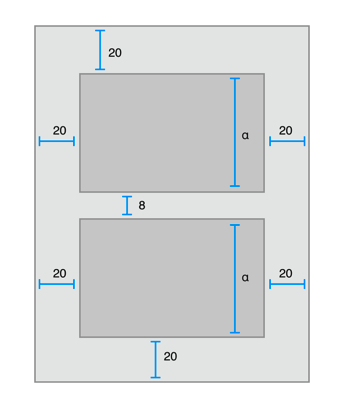

# :one: Frame 기반 Layout vs. AutoLayout
## Frame 기반 Layout이 View를 배치하는 방법

- 코드로 View의 Frame을 하나하나 설정해준다.
    - View의 위치, 원점, 높이, 너비 등
- 모든 View에 대한 크기와 위치를 계산해줘야 한다.

:question: 이러한 Layout은 어떤 장점이 있을까요?
- 인터페이스에 변경이 있을 때, 개발자가 원하는 대로 변경을 할 수 있다.

:question: 이러한 방식은 어떤 문제가 생길 수 있을까요?
- 인터페이스에 변경이 있을 때, 이에 영향을 받는 모든 View에 대해 Frame을 다시 계산해야 한다.
## AutoLayout이 View를 배치하는 방법

- View의 Frame이 아닌 View 사이의 관계에 대해서 생각한다.
- 제약 조건으로 사용자 인터페이스, 각 View의 크기와 위치를 계산한다.
    - 제약 조건은 View 사이의 관계이다.
- 내부와 내부 변경 모두에 동적으로 반응하는 레이아웃을 생성한다.

:question: 이러한 Layout은 어떤 장점이 있을까요?
- 기기마다 다양한 해상도에 대응할 수 있게 한다.
- 별다른 기능을 추가하지 않아도  다양한 아이폰 크기에 맞춰서 대응한다.

:question: 이러한 방식은 어떤 문제가 생길 수 있을까요?
- Frame-Based Layout보다 속도가 느리다.
# :two: 외부 변경 (External Changes)과 내부 변경 (Internal Changes)
```
AutoResizing Mask
- Super View의 Frame이 변경될 때 View의 Frame이 변경되는 방식을 정의한다.
- 하지만 AutoResizing Mask는 상대적으로 작은 단위의 변경을 지원하기 때문에, 복잡한 사용자 인터페이스인 경우에는 일반적으로 Frame-Based Layout 방식으로 AutoResizing Mask를 보강해야 한다.
- AutoResizing Mask는 외부 변경에만 적용된다
```
## 외부 변경
- Super View의 크기나 모양이 변경되면 발생한다.
- 변경될 때마다 View Hierarchy의 레이아웃을 업데이트해야 한다.
```
- 사용자가 window 사이즈를 변경할 때 (OS X)
- 사용자가 iPad에서 Split View에 진입하거나 떠날때 (iOS)
- 디바이스가 회전될 때 (iOS)
- 통화 혹은 오디오 녹음 bar가 나타나거나 사라질 때 (iOS)
- 다양한 Size Class를 지원할 때
- 다양한 screen size를 지원할 때
```
## 내부 변경
- 사용자 인터페이스에 의해 View의 크기 또는 컨트롤의 크기가 변경될 때 발생한다.
- 앱의 콘텐츠가 변경되면 이전과 다른 레이아웃이 필요할 수 있다.
```
- App에 표시되는 콘텐츠가 변경될 때
- App이 국제화를 지원하는 경우
- App이 Dynamic Type을 지원하는 경우 (iOS)
```
# :three: Layout Margins
## Layout Margins
## AutoLayout의 속성 (Attributes)
## 위치를 나타내는 속성
:question: 위치를 나타내는 속성을 지정할 때 유의해야 할 것은 무엇이 있을까요?
## 크기를 나타내는 속성
:question: 크기를 나타내는 속성을 지정할 때 유의해야 할 것은 무엇이 있을까요?
# :four: 안전 영역 (Safe Area)
## 안전 영역의 등장 배경
## 안전 영역을 지키지 않고 Layout을 구성하면 어떻게 될까?
## 안전 영역을 이용 방법
# :five: 제약 (Constraints)
## 제약 (Constraint)
## 제약 (Constraint) 설정 방법
## 고유 컨텐츠 크기 (Intrinsic Content Size)
:question: `UILabel`의 고유 컨텐츠 크기는 어떻게 정해질까요?

:question: `UIImageView`의 고유 컨텐츠 크기는 어떻게 정해질까요?

:question: `UILabel`의 높이(여러 줄 가정)를 어떻게 구할까요?
## 제약 우선도 (Constraints Priorites)
# :six: Human Interface Guideline (HIG)
## Human Interface Guideline
## Human Interface Guideline이 가지고 있는 중요한 요소들
## Human Interface Guideline의 이점
## HIG를 참고해야 하는 이유