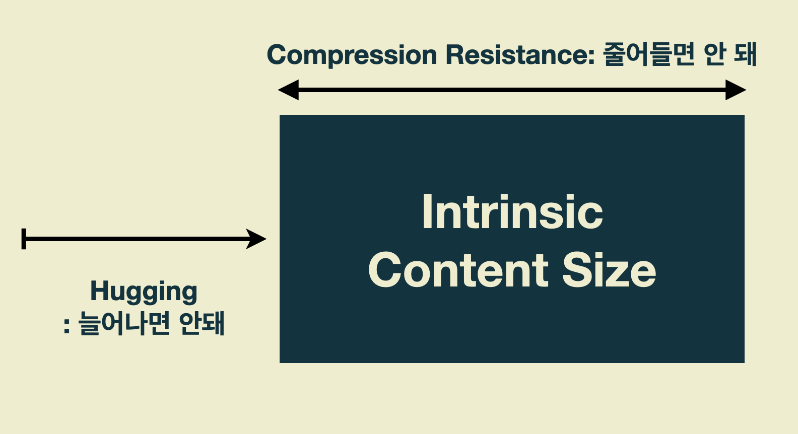

# :one: Frame 기반 Layout vs. AutoLayout

## Frame 기반 Layout이 View를 배치하는 방법


- 코드로 View의 Frame을 하나하나 설정해준다.
  - View의 위치, 원점, 높이, 너비 등
- 모든 View에 대한 크기와 위치를 계산해줘야 한다.

:question: 이러한 Layout은 어떤 장점이 있을까요?

- 인터페이스에 변경이 있을 때, 개발자가 원하는 대로 변경을 할 수 있다.

:question: 이러한 방식은 어떤 문제가 생길 수 있을까요?

- 인터페이스에 변경이 있을 때, 이에 영향을 받는 모든 View에 대해 Frame을 다시 계산해야 한다.

## AutoLayout이 View를 배치하는 방법


- View의 Frame이 아닌 View 사이의 관계에 대해서 생각한다.
- 제약 조건으로 사용자 인터페이스, 각 View의 크기와 위치를 계산한다.
  - 제약 조건은 View 사이의 관계이다.
- 내부와 내부 변경 모두에 동적으로 반응하는 레이아웃을 생성한다.

:question: 이러한 Layout은 어떤 장점이 있을까요?

- 기기마다 다양한 해상도에 대응할 수 있게 한다.
- 별다른 기능을 추가하지 않아도 다양한 아이폰 크기에 맞춰서 대응한다.

:question: 이러한 방식은 어떤 문제가 생길 수 있을까요?

- Frame-Based Layout보다 속도가 느리다.

# :two: 외부 변경 (External Changes)과 내부 변경 (Internal Changes)

> :pushpin: AutoResizing Mask
>
> - Super View의 Frame이 변경될 때 View의 Frame이 변경되는 방식을 정의한다.
> - 하지만 AutoResizing Mask는 상대적으로 작은 단위의 변경을 지원하기 때문에, 복잡한 사용자 인터페이스인 경우에는 일반적으로 Frame-Based Layout 방식으로 AutoResizing Mask를 보강해야 한다.
> - AutoResizing Mask는 외부 변경에만 적용된다.

## 외부 변경

- Super View의 크기나 모양이 변경되면 발생한다.
- 변경될 때마다 View Hierarchy의 레이아웃을 업데이트해야 한다.

```
- 사용자가 window 사이즈를 변경할 때 (OS X)
- 사용자가 iPad에서 Split View에 진입하거나 떠날때 (iOS)
- 디바이스가 회전될 때 (iOS)
- 통화 혹은 오디오 녹음 bar가 나타나거나 사라질 때 (iOS)
- 다양한 Size Class를 지원할 때
- 다양한 screen size를 지원할 때
```

## 내부 변경

- 사용자 인터페이스에 의해 View의 크기 또는 컨트롤의 크기가 변경될 때 발생한다.
- 앱의 콘텐츠가 변경되면 이전과 다른 레이아웃이 필요할 수 있다.

```
- App에 표시되는 콘텐츠가 변경될 때
- App이 국제화를 지원하는 경우
- App이 Dynamic Type을 지원하는 경우 (iOS)
```

# :three: Layout Margins

## Layout Margins


- 컨텐츠들의 위치를 조정한다.
- 컨텐츠들이 겹치는 것을 막아줄 수 있다.
  

## AutoLayout의 속성 (Attributes)

```swift
var layoutMargins: UIEdgeInsets { get set }
```

## 위치를 나타내는 속성

```swift
view.layoutMargins = UIEdgeInsets(top: 10, left: 10, bottom: 20, right: 20)
// iOS 11 ~
view.directionalLayoutMargins = NSDirectionalEdgeInsets(top: 10, leading: 10, bottom: 10, trailing: 10)

```

:question: 위치를 나타내는 속성을 지정할 때 유의해야 할 것은 무엇이 있을까요?

- Root view에 지켜줘야 하는 최소한의 layout margin값이 있다.
- 지정해준 Margin값이 최소 Margin값보다 작다면, 지정 값에 상관없이 최소 Margin값으로 대체된다.

## 크기를 나타내는 속성

:question: 크기를 나타내는 속성을 지정할 때 유의해야 할 것은 무엇이 있을까요?

- Margin값을 고려한 후 크기는 자동으로 지정되는데, 여기에 또 크기를 지정하는 Constraint를 추가하면 충돌이 발생할 수 있다.

# :four: 안전 영역 (Safe Area)

> :pushpin: Safe Area
>
> - 단말기의 UI에서 컨텐츠를 제대로 나타낼 수 있는 부분에만 View를 놓을 수 있게 하는 기능
> - 최소 Margin값이 적용된 영역 = Safe Area 영역


## 안전 영역 이용 방법

```swift
var safeAreaLayoutGuide: UILayoutGuide { get }
```

# :five: 제약 (Constraints)


## 제약 (Constraint)

- 각 객체가 가질 수 있는 여백, 정렬 방법, 다른 객체와의 간격 등
- 자동 레이아웃을 적용하지 않으면, 기기의 디스플레이마다 객체가 다르게 표시되는 문제를 해결한다.

## 고유 컨텐츠 크기 (Intrinsic Content Size)



> AutoLayout이 자동 설정하는 조건

- 일반 UIView와 UILabel의 AutoLayout은 다르다.
  - UILabel은 조건을 전부 지정해주지 않아도 에러가 발생하지 않는다.
- UI 안에 기본 컨텐츠가 포함되어 있는 경우, 고유 컨텐츠 크기에 맞춰 조건이 자동으로 만들어진다.

## 제약 우선도 (Constraints Priorites)

- 제약조건을 두었을 때, 다른 Lable을 기준으로 조건을 두게 된다.
- 이 때, 어떤 Label이 먼저 설정되어야 그것을 기준으로 다른 Lable도 제약을 걸어줄 수 있다.
- 어떠한 Lable을 먼저 둘 지, 그 기준을 알려주기 위해 우선도가 필요하다.

# :six: Human Interface Guideline (HIG)

## Human Interface Guideline

### Design

- 앱의 기능과 디자인이 잘 어울리는지 확인한다.
- 앱의 아이콘, 텍스트 스타일 등 일관된 디자인으로 사용자에게 편리함을 제공한다.
- 사용자들이 앱을 조작함으로 이에 대한 반응을 즉각적 시각적으로 확인하게 한다.
- 책을 넘기는 실제경험과 빗대어 사용자가 스와이프하며 화면을 전환하는 등 사용자가 앱의 기능을 쉽게 이해할 수 있도록 만든다.
- 사용자가 전체적으로 앱을 통제하고 있는 느낌을 준다.
  - 예) 인스타그램에서 혐오적인 컨텐츠는 표시 전에 알림을 준다

### Interface

- iOS에서의 UI구성은 모두 UIKit을 사용한다.

1. Bar

- 사용자가 어디있는지 알려주며, 네비게이션을 제공한다.
- 동작을 시작하거나 정보를 전달하기 위한 버튼이나 다른 요소를 포함할 수 있다.

2. View

- 텍스트, 그래픽, 애니메이션, 상호작용 요소
- 사용자가 앱에서 보는 주요한 내용이다.
- 뷰는 스크롤, 삽입, 삭제나 배치와 같은 동작을 가능하게 한다.

3. Control

- 동작을 시작하며 정보를 전달한다.
- 버튼, 스위치, 텍스트 영역, 작업 진행 표시자(인디케이터) 등

### iOS만의 차별점

1. 명확성

- 문자는 각각의 크기마다 읽기 쉬워야 한다.
- 아이콘은 정확하고 뚜렷해야 한다.
- 기능에 명확히 집중할 수 있는 디자인이어야 한다.

2. 존중

- 모든 화면을 활용하여 컨텐츠를 표시한다.
- 베젤, 그라데이션, 그림자를 최소화 하여 컨텐츠를 강조한다.

3. 깊이

- 뚜렷한 시각적 레이어와 사실적인 모션은 계층 구조를 이해하기 쉽게 돕는다.
- 터치와 검색 기능은 컨텐츠에 접근하기 쉽도록 도와준다
- 컨텐츠 탐색 시 깊이감을 제공하도록 화면전환을 제공한다.

## Human Interface Guideline의 이점

1. 사용자들이 사용하기 편한 앱을 만들 수 있다.
2. 이를 지키지 않으면 스토어에서 리젝사유가 될 수 있다.
3. 디자이너, 기획자와 협업 시 원활한 소통을 기대할 수 있다.
