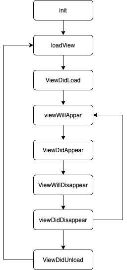
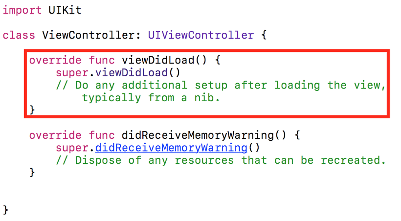

# :one: ViewController Life Cycle



## loadView

- View를 메모리에 올리는 함수이다.

## viewDidLoad



- View의 로딩이 완료되었을 때 시스템에 의해 자동으로 호출된다.
- 리소스를 초기화하거나 초기 화면을 구성하는 용도로 사용한다.

## viewWillAppear

- View가 나타나기 직전에 호출된다.
- View가 이제 나타날 것이라는 신호를 컨트롤러에게 준다.

## viewDidAppear

- View가 화면에 나타난 직후에 실행된다.
- View가 나타났다는 것을 컨트롤러에게 알힌다.
- 화면의 애니메이션을 그린다.

## viewWillDisappear

- View가 삭제되려고 하는 상황을 ViewController에 알린다.

## viewDidDisappear

- View가 삭제되었음을 알려준다.

# :two: Optional

- 값이 들어갈 수도 있고, 아닐 수도 있다(Optional)
- nil을 가지려면 Optional을 사용해야 한다
- Optional로 선언된 자료형은, Optional로 Wrapping되어 있다.

```
let myFirstOptionalVar: Int?

let possibleNumber = “123”
let convertedNumber = Int(possibleNumber)
print(convertedNumber)
// 출력 결과 : Optional(123)
```

# Optional Binding

```swift
var value: String? = "test"
var forcedvalue: String = value!
```

- Force unwrapping : !를 사용하여 강제로 옵셔널을 추출

```swift
var myName: String? = "shine"
var yourName: String? = nil

if let name = myName, let friend = yourName {
	print("not in")
}

yourName = "jrary"

if let name = myName, let friend = yourName {
	print("we are \(name) and \(friend)")
}
```

- Optional Binding : if let, guard let을 써서 옵셔널을 추출

> 💡Optional을 Unwrapping 하고자 하는 변수가 nil이면 안 된다.

# Optional Chaining

- 체인의 형태처럼 연쇄적으로 Optional에 접근한다.

```swift
let user = null;

alert( user?.address ); // undefined
alert( user?.address.street ); // undefined
```

- `?.`은 `?.` 앞의 평가 대상이 nil이면 평가를 멈추고 nil을 반환한다.

# :three: guard문

# :four: 화면 전환

## present

## Navigation Controller

# :five: ViewController 간의 데이터 전달
