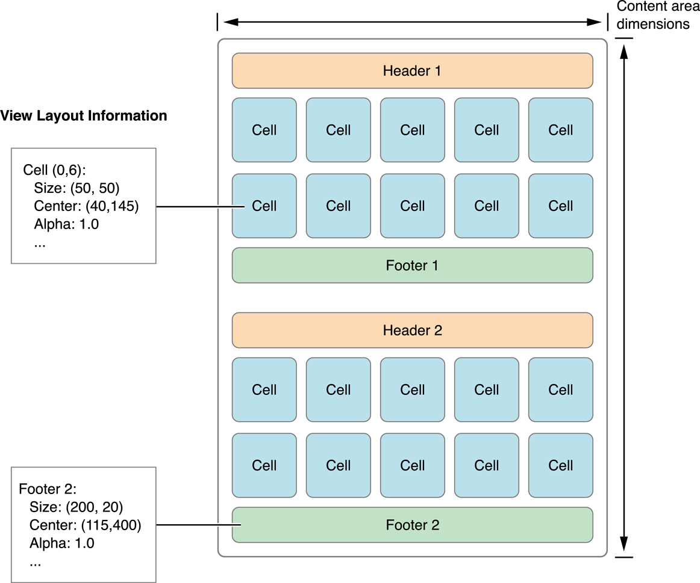
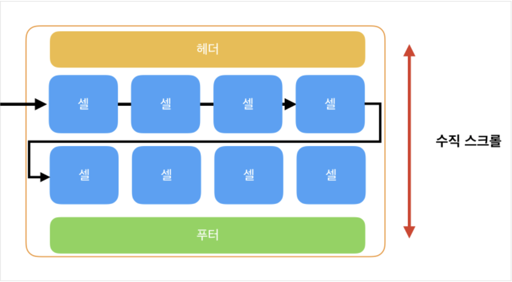
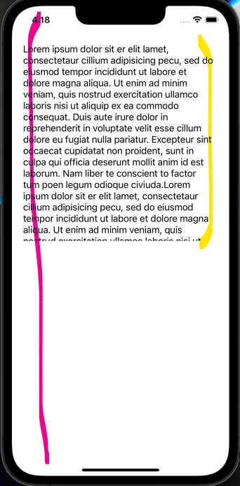

# :one: TableView


```swift
@MainActor class UITableview : UIScrollView
```

```swift
var tableView = UITableView(frame: .zero, style: .insetGrouped)
```

- 하나의 열에 세로로 스크롤되는 콘텐츠 행들이 나타난다.

- 종류
  - plain : 기본 형태
  - grouped : 각 섹션에 고유한 행들의 그룹이 존재
  - insetGrouped : 각 섹션의 그룹을 둥근 모서리로 처리

## UITableViewCell

```swift
@MainActor class UITableViewCell : UIview
```

- TableView의 개별 항목들을 Cell이라고 한다.
- TableView에서 단일 행을 관리한다.

### Cell Reuse

- Cell을 한꺼번에 메모리에 올리기 - 시스템 과부하
- dequeue 방식으로 화면에 표시될 Cell만 업로드하기 - Overhead 발생
- ➡️ 생성되었던 Cell을 재사용한다.

### Accessory View

- AccessoryView Type

  > cell.accessoryType = .disclosureIndicator
  >
  > cell.accessoryType = .checkmark
  >
  > cell.accessoryType = .detailButton
  >
  > cell.accessoryType = .detailDisclosureButton

- AccessoryView에 tap 이벤트 설정하기

```swift
func tableView(_ tableView: UITableView, accessoryButtonTappedForRowWith indexPath: IndexPath) {
    // tap 이벤트 구현
}
```

## UITableViewDataSource

- Cell에 데이터를 적용하고 이를 TableView에 띄운다.
- ViewController에 UITableDataSource의 extension을 설정하여 사용한다.

```swift
extension ViewController: UITableViewDataSource {
    func tableView(_ tableView: UITableView, numberOfRowsInSection section: Int) -> Int {
        return data[section].count
    }
    func tableView(_ tableView: UITableView, cellForRowAt indexPath: IndexPath) -> UITableViewCell {
        let cell = UITableViewCell(style: .default, reuseIdentifier: .none)
        cell.textLabel?.text = data[indexPath.section][indexPath.row]
        return cell
    }
}
```

## UITableViewDelegate

- TableView가 해야하는 일을 UITableViewDelegate에게 위임해서 기능들을 수행
  > - Custom Header 및 Footer View를 만들고 관리하기
  > - Row, Header 및 Footer에 대한 사용자 정의 높이를 지정하기
  > - 더 나은 스크롤 지원을 위해 높이 추정치를 제공하기
  > - Row에 Indent를 부여하기
  > - Row 선택에 응답하기
  > - Swipe를 포함한 action에 응답하기
  > - table의 내용을 편집하는데 도움 주기

# :two: CollectionView



- 여러 데이터를 관리하고 커스텀 가능한 레이아웃을 사용해서 사용자에게 보여준다.
- Layout을 잡기 위해 각 아이템의 width, height 정보를 모두 필요로 한다.

```swift
class UICollectionView : UIScrollView
```

- Data Source
  - Collection View에서 특정 Section의 아이템 수를 반환해야 함
- Data
  - indexPath based protocol을 통해 data source에 의해 관리됨
- Delegate
  - 사용자에 관한 터치 이벤트 가 발생했을 때 관련 메소드를 호출함
- Cell

  - 컬렉션 뷰의 콘텐츠 표시

- Supplementary Views

  - 섹션에 대한 정보 표시(헤더, 푸터), 꼭 구현하지 않아도 됨.

- UICollectionViewDataSource, UICollectionViewDelegate

  - 컬렉션뷰에 표시할 콘텐츠 정보 관리 및 제공, 사용자와 콜렉션뷰 간의 상호작용 관리

- UICollectionReusableView
  - 뷰를 재사용하여 성능을 향상시킴

## UICollectionViewLayout

## UICollectionViewFlowLayout

- CollectionView에 대한 Layout 정보를 생성하기 위한 기본 클래스이다.
- 현재 행에서 채우다가, 객체의 공간이 부족하면 새로운 행을 생성한다.

1. 수직 스크롤
   

- 왼쪽에서 오른쪽으로 셀들을 추가하고 공간이 부족하면 다음 행으로 넘어감

2. 수평 스크롤
   

- 헤더 푸터가 양쪽 끝에 있는것이 특징
- 셀들이 위에서 아래로 채워지다가 열을 다 채웠으면 다음 열로 넘어감

3. 단일행 스크롤
   

# :three: ScrollView

- 스크롤과 줌인을 할 수 있는 View이다.
- UITableView, UITextView 등과 같은 여러 UIKit 클래스의 상위 클래스이다.

```swift
@MainActor class UIScrollView : UIView
```

- 안에 들어가는 Content View에 맞게 Origin이 조정된다.
- Storyboard에서 UIScrollView를 생성하면 ContentLayout과 FrameLayout이라는 요소가 함께 존재한다.

## Layout 구조



- 노란 부분 - Frame Layout
- 빨간 부분 - Content Layout

## Frame Layout Guide

- 프레임 레이아웃 안에 Scroll View가 있는 형태이다.
- Scroll View 자체의 레이아웃이다.

## Content Layout Guide

- Content를 담고 있는 View의 레이아웃이다.
- Content가 Frame Layout보다 작으면 스크롤을 사용하는 의미가 없어진다.

# :four: protocol

# :five: delegate

# :six: DataSource
