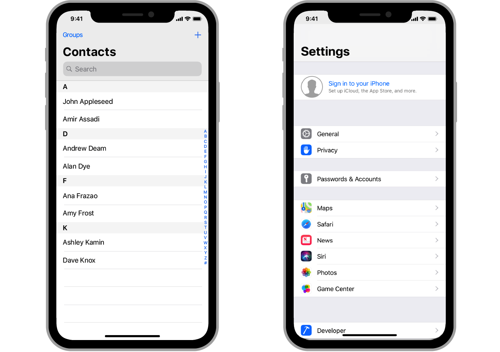

# :one: TableView



```swift
@MainActor class UITableview : UIScrollView
```

```swift
var tableView = UITableView(frame: .zero, style: .insetGrouped)
```

- 하나의 열에 세로로 스크롤되는 콘텐츠 행들이 나타난다.

- 종류
  - plain : 기본 형태
  - grouped : 각 섹션에 고유한 행들의 그룹이 존재
  - insetGrouped : 각 섹션의 그룹을 둥근 모서리로 처리

## UITableViewCell

```swift
@MainActor class UITableViewCell : UIview
```

- TableView의 개별 항목들을 Cell이라고 한다.
- TableView에서 단일 행을 관리한다.

### Cell Reuse

- Cell을 한꺼번에 메모리에 올리기 - 시스템 과부하
- dequeue 방식으로 화면에 표시될 Cell만 업로드하기 - Overhead 발생
- ➡️ 생성되었던 Cell을 재사용한다.

### Accessory View

- AccessoryView Type

  > cell.accessoryType = .disclosureIndicator
  >
  > cell.accessoryType = .checkmark
  >
  > cell.accessoryType = .detailButton
  >
  > cell.accessoryType = .detailDisclosureButton

- AccessoryView에 tap 이벤트 설정하기

```swift
func tableView(_ tableView: UITableView, accessoryButtonTappedForRowWith indexPath: IndexPath) {
    // tap 이벤트 구현
}
```

## UITableViewDataSource

- Cell에 데이터를 적용하고 이를 TableView에 띄운다.
- ViewController에 UITableDataSource의 extension을 설정하여 사용한다.

```swift
extension ViewController: UITableViewDataSource {
    func tableView(_ tableView: UITableView, numberOfRowsInSection section: Int) -> Int {
        return data[section].count
    }
    func tableView(_ tableView: UITableView, cellForRowAt indexPath: IndexPath) -> UITableViewCell {
        let cell = UITableViewCell(style: .default, reuseIdentifier: .none)
        cell.textLabel?.text = data[indexPath.section][indexPath.row]
        return cell
    }
}
```

## UITableViewDelegate

- TableView가 해야하는 일을 UITableViewDelegate에게 위임해서 기능들을 수행
  > - Custom Header 및 Footer View를 만들고 관리하기
  > - Row, Header 및 Footer에 대한 사용자 정의 높이를 지정하기
  > - 더 나은 스크롤 지원을 위해 높이 추정치를 제공하기
  > - Row에 Indent를 부여하기
  > - Row 선택에 응답하기
  > - Swipe를 포함한 action에 응답하기
  > - table의 내용을 편집하는데 도움 주기

# :two: CollectionView

# :three: ScrollView

# :four: TableViewCell

# :five: CollectionViewCell

# :six: protocol

# :seven: delegate

# :eight: DataSource
